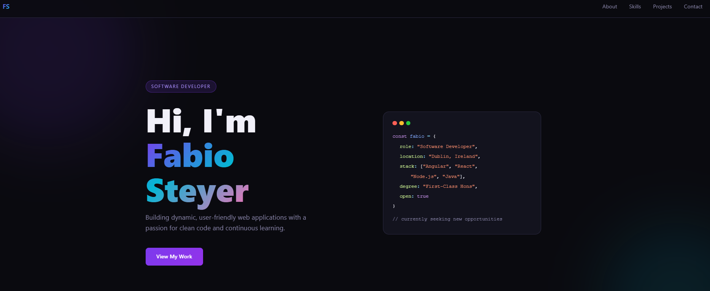
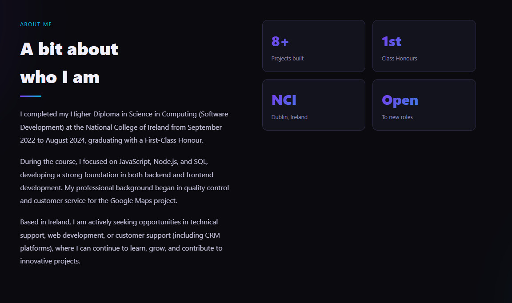
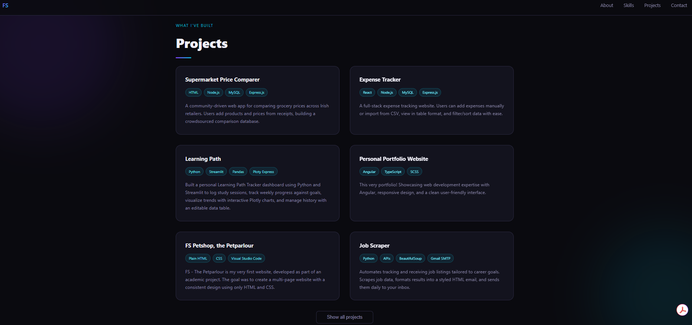

## Fabio Portfolio (Static)

Live: https://www.fabiosteyerportfolio.com/

### Overview

Single-page portfolio built with HTML, CSS, and vanilla JavaScript. Designed to be fast, responsive, and easy to deploy on GitHub Pages.

### Tech Stack

- HTML5
- CSS3 (CSS variables, Grid/Flexbox, responsive layout)
- JavaScript (DOMContentLoaded animation, IntersectionObserver reveal, project list toggle)

### Local Run

- Open `index.html` directly in your browser, or
- Use a simple static server (recommended) to avoid any browser restrictions when loading local files.

### Deployment

This repository is configured for GitHub Pages + custom domain:

- `index.html` as the entry point
- `CNAME` set to `www.fabiosteyerportfolio.com`

### Structure

- `index.html`: page markup
- `style.css`: styles
- `script.js`: interactions/animations
- `assets/screenshot.png`: project screenshot
